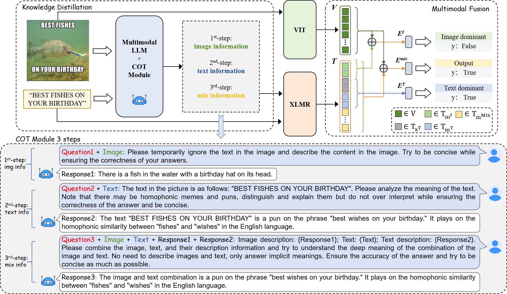

# C4MMD: Exploring Chain-of-Thought for Multi-modal Metaphor Detection

## Abstract
Metaphors are commonly found in advertising and internet memes. However, the free form of internet memes often leads to a lack of high-quality textual data. Metaphor detection demands a deep interpretation of both textual and visual elements, requiring extensive common-sense knowledge, which poses a challenge to language models. To address these challenges, we propose a compact framework called C4MMD, which utilizes a **C**hain-of-Thought(CoT) method **for** **M**ulti-modal **M**etaphor **D**etection. Specifically, our approach designs a three-step process inspired by CoT that extracts and integrates knowledge from Multi-modal Large Language Models(MLLMs) into smaller ones. We also developed a modality fusion architecture to transform knowledge from large models into metaphor features, supplemented by auxiliary tasks to improve model performance. Experimental results on the MET-MEME dataset demonstrate that our method not only effectively enhances the metaphor detection capabilities of small models but also outperforms existing models. To our knowledge, this is the first systematic study leveraging MLLMs in metaphor detection tasks.
The main process of our method is shown in the following figure.

 


## Table of Contents

- [Installation](#installation)
- [Usage](#usage)
- [Citation](#Citation)

## Installation

You may need to download the following content in advance to use our code：
1. [MET-Meme Dataset](https://github.com/liaolianfoka/MET-Meme-A-Multi-modal-Meme-Dataset-Rich-in-Metaphors)
2. [InternLM-XComposer](https://github.com/InternLM/InternLM-XComposer) model and it's inference demo(as our demo may out of date, we recommend you to use the latest one.).
3. Pre-trained [Vision](https://huggingface.co/google/vit-base-patch16-224) and [Language](https://huggingface.co/FacebookAI/xlm-roberta-base) models used in mordality fusion structure.

After that, you can use our code by:
```bash
https://github.com/xyz189411yt/C4MMD.git
cd C4MMD-main
pip install -r requirements.txt
```
**Note:** The version of Torch and Transformers is 1.13.0 and 4.24.0.

## Usage

You need to follow the three steps to run the model.

Step 1: [Data pre-processing](#Data-pre-processing) -> [data_divide.py](data_divide.py)
Step 2: [CoT module for MLLM](#CoT-module-for-MLLM) -> [CoT_module.py](CoT_module.py)
Step 3: [Main training process](#Main-training-process) -> [C4MMD_train.py](C4MMD_train.py)

### Step1: Data pre-processing

The original dataset did not be divided into training, testing, and validation sets, so we provided [data_divide.py](data_divide.py) for dividing the dataset. 
We also merged the image-text correspondence files and image-label correspondence files.

You can only cahnge the data path of this file and run it with the following line.

```bash
python data_divide.py
```

It should be noted that we have given a example in this file to showcase our data processing method. You can also use a data format as you wish, but just ensure that the final data format is the same as in the [data](/data) folder to execute the final training process.


### Step2: CoT module for MLLM

[CoT_module.py](CoT_module.py) contains our main contribution.
You need to first modify the read and save paths around line 142, and then run it:

```bash
python CoT_module.py
```
If you successfully execute the [CoT_module.py](CoT_module.py), you will find that a new data file (new_xxx.json) has been created in the [data](/data) folder. Each example has three additional attributes corresponding to the three modal features generated by MLLM: 
- internlm_img_info: additional image information
- Internlm_text_info: additional text information
- Internlm_mix_info: Additional information after mixing two modalities.

If you want to try other MLLMs, just take it to fit the CoT module section (after line 137).

### Step3: Main training process

If you have processed the data in the format of [data](/data), you only need to modify each file path and pre-trained models in [C4MMD_train.py](C4MMD_train.py) to use the following command to train the model.

```bash
python C4MMD_train.py
```

## Citation
This project is currently contributed by Yanzhi Xu*, Yueying Hua*, Shichen Li and Zhongqing Wang from Natural Language Processing Lab, Soochow University.

```bib
@inproceedings{xu2024C4MMD,
    title = "Exploring Chain-of-Thought for Multi-modal Metaphor Detection",
    author = "Xu, Yanzhi  and
      Hua, Yueying  and
      Li, Shichen  and
      Wang, Zhongqing",
    booktitle = "Proceedings of ACL",
    year = "2024",
}
```
